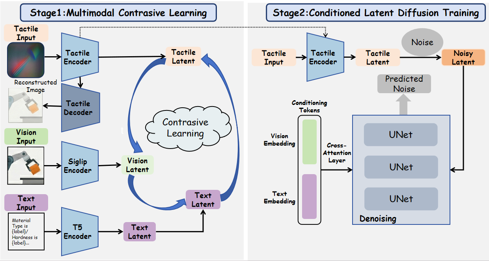
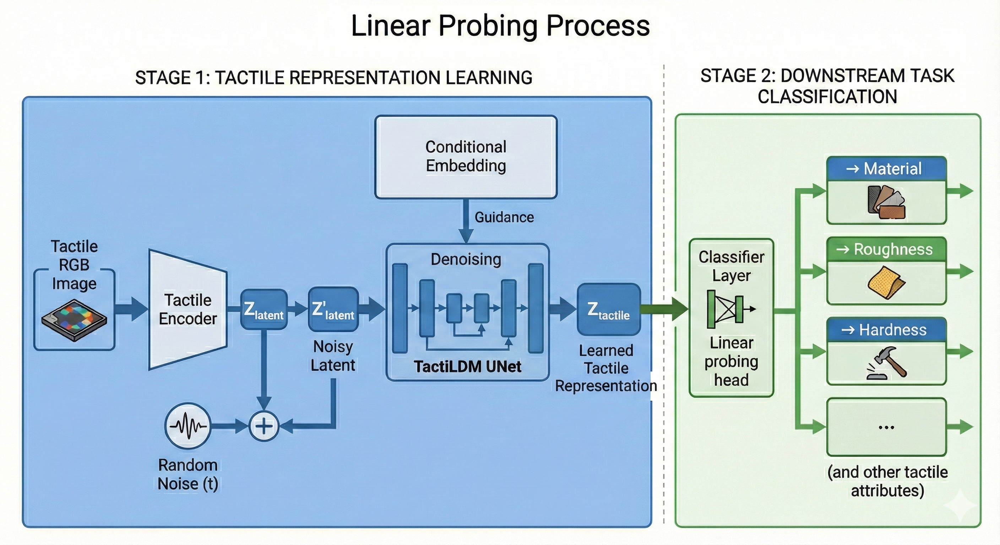
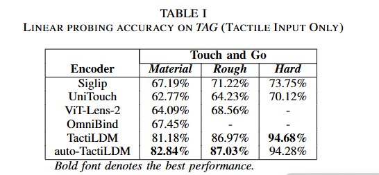
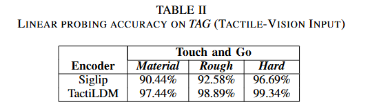
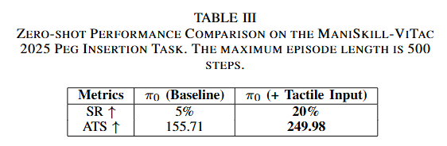

## TactiLDM for VLA: Learning Unified Visual-Text-Tactile Representations to Empower Vision-Language-Action Policies

> Accepted by ISAI 2026.

Authors: [Zhiyan Li](https://github.com/lzy001Yuki)\*, [Hantao Jiang](https://github.com/T-Eric)\*

- [Source Code](https://github.com/lzy001Yuki/TactiLDM/tree/LDMTacEnc?tab=readme-ov-file)

- [Paper](CV_Project_Paper.pdf)

### Abstract
Integrating tactile perception into Vision-Language-Action (VLA) models is essential for achieving human-level dexterity and robust physical interaction in robotics. In this paper, we propose **TactiLDM**, a novel framework designed to learn unified visual-text-tactile representations within a Latent Diffusion Model (LDM) framework. Our approach employs a two-stage training strategy:1. align tactile embeddings with vision and text modalities through contrastive learning;2. utilize a conditional latent diffusion process, capturing both high-level semantics and intrinsic physical attributes. On Touch and Go (TAG) dataset, TactiLDM achieves 82.84% accuracy in tactile-only material classification, outperforming prior tactile encoders by over 15%. In *zero-shot* tactile task environment, π0 policy with tactile modality integration achieves 4x increase in success rate and a 60% improvement in interaction stability. These results pave the way for more capable multimodal robotic systems. 
### Architecture

### Results

#### Linear Probe

**Baselines.** To demonstrate the effectiveness of our **TactiLDM** and **auto-TactiLDM**, we compare the performance of our learned tactile representation with **SigLIP**,**UniTouch**,**ViT-Lens-2**,**OmniBind**.

We evaluate the quality of our learned representations under two distinct settings:  
(1) a *Tactile-Only* setting, to measure the intrinsic discriminative ability of the tactile encoder, and  
(2) a *Tactile-Vision Fused* setting, to assess how tactile features complement visual information when combined.

##### Tactile-Only Performance

##### Tactile-Vision Fused Performance

##### Implicit Physical Encoding
Beyond explicit classification benchmarks, we further investigate the intrinsic semantic ability of our model. We observe that when **TactiLDM** is trained only with "full" labels (for material type classification), it achieves a success rate of 92.34% on hardness estimation in the *Tactile Input Only Setting*. This demonstrates the model's ability to *implicitly* encode fundamental material-level priors. This finding underscores the effectiveness of our Latent Diffusion framework in learning transferable physical representations that go beyond simple pattern matching.
#### VTLA Performance On Maniskill-Vitac 2025

**Baseline.** We adopt π0 as baseline, which employs a novel flow matching architecture built upon a pre-trained Vision-Language Model, demonstrating strong zero-shot generalization and the ability to perform dexterous tasks.

**Challenges and Approach.** In simulation environments including **ManiSkill-ViTac 2025**, there is a scarcity of trajectory demonstrations, which restricts the application of imitation learning. Because of these challenges, we directly adopt π0 inference by concatenating tactile observations into its input modality stream and evaluate it in a *zero-shot* setting.

**Metrics.** We employ the following metrics to quantify the model's performance:

- *Success Rate (SR):* The percentage of evaluation episodes that are completed successfully according to the task-specific success criteria.

- *Average Truncation Step (ATS):* The average timestep at which an episode is terminated. The platform simulates a soft, deformable tactile sensor. If the policy causes excessive deformation during an action chunk, a `tactile_movement_too_large` error is triggered, causing immediate episode truncation. A higher ATS indicates the model effectively interprets tactile images and modulates its actions to maintain safe contact.

**Results.**

